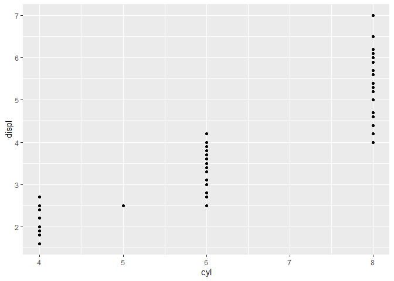

``` r
"This is an rmarkdown"
```

    ## [1] "This is an rmarkdown"

``` r
print(1)
```

    ## [1] 1

``` r
library(ggplot2)
library(magrittr)
```

``` r
mpg %>%
  ggplot(aes(x = cyl, y = displ)) +
  geom_point()
```

<!-- -->
